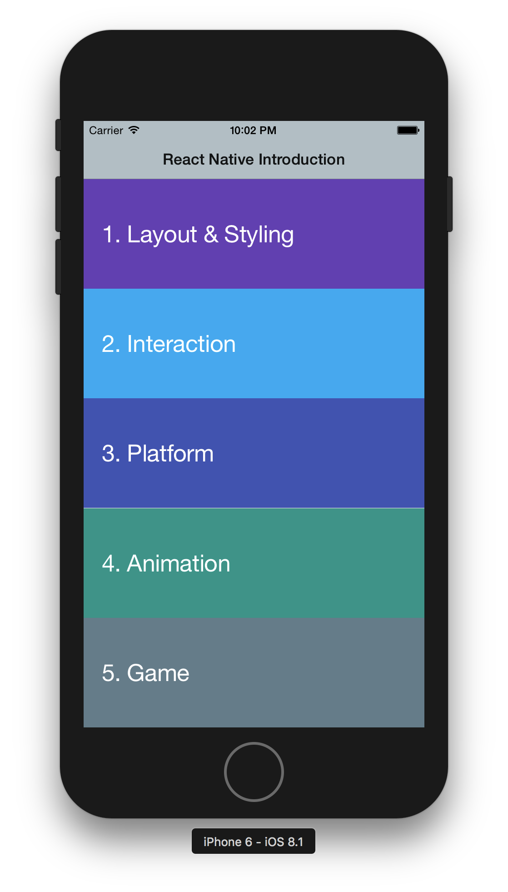

[Facebook Guide](https://facebook.github.io/react-native/docs/getting-started.html) on running on emulator

Install Expo application on the mobile ([Androd](https://play.google.com/store/apps/details?id=host.exp.exponent&hl=en) or [iOS](https://itunes.apple.com/us/app/expo-client/id982107779?mt=8))
 
 Scan QR code from expo
 
 
 Direct [Link to a Expo package](https://expo.io/@innerself/reactnativeintroduction)
 
 You should see this app
 
 
 
 Slides are available [here](https://www.slideshare.net/secret/GF6seAhXL8eoI7) 
 